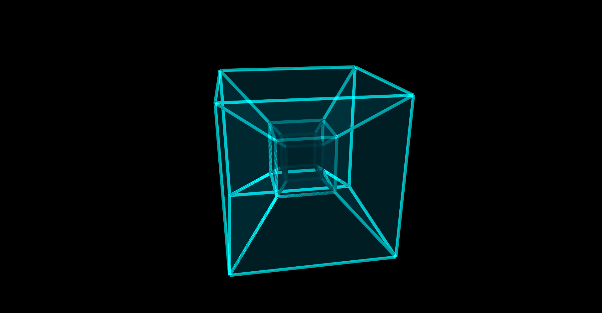

# Hypercube Visualization

A real-time hypercube projection and rendering demo built with C++/CUDA, SDL3, and legacy OpenGL.

This project builds a 5-dimensional hypercube model, applies high-dimensional rotations across all coordinate planes, projects the result into three dimensions, and renders the dynamic structure with translucent faces, glowing edges, and animated vertices. The application uses CUDA kernels for parallel rotation and projection computation, SDL3 for window and event handling, and OpenGL for graphical output.

## Result

## References
- H. S. M. Coxeter, *Regular Polytopes* (3rd ed.), Dover Publications, 1973.
- Khronos Group, *OpenGL Reference Pages*. https://registry.khronos.org/OpenGL/
- SDL Development Team, *SDL3 Documentation*. https://wiki.libsdl.org/SDL3